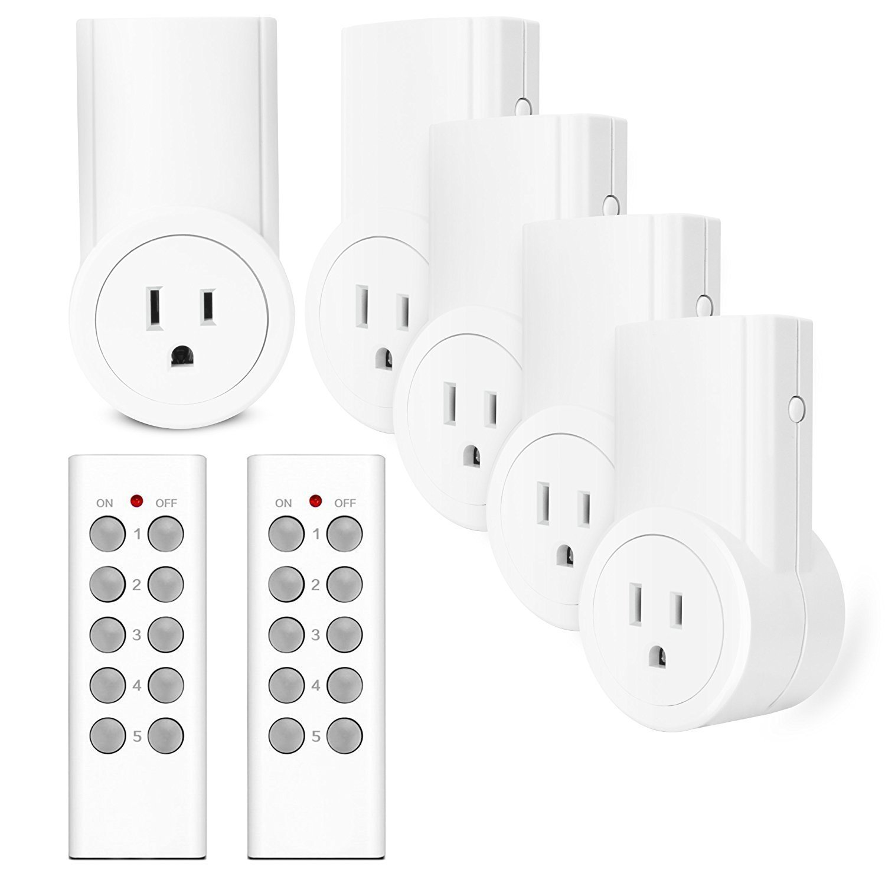

# etekcity-outlet-api

API Endpoint for Etekcity Outlets

## Parts

* ($29.98) Etekcity Wireless Remote Control Electrical Outlet 5Rx-2Tx: <http://a.co/3saFR3A>
* ($2.56)  433Mhz RF transmitter and receiver kit: <http://a.co/az2rn6f>
* ($3.50)  WEMOS D1 mini (ESP8266) Choose one:
	* v3.0.0 ($3.50): [aliexpress wemos](https://www.aliexpress.com/store/product/D1-mini-Mini-NodeMcu-4M-bytes-Lua-WIFI-Internet-of-Things-development-board-based-ESP8266/1331105_32529101036.html?spm=2114.12010608.0.0.7a2e719fKwc0Az)
	* v1 ($2.69) [aliexpress wemos](https://www.aliexpress.com/item/ESP8266-ESP12-ESP-12-WeMos-D1-Mini-WIFI-Dev-Kit-Development-Board-NodeMCU-Lua/32653918483.html?spm=2114.search0104.3.2.6a801ed5nPwD8c&ws_ab_test=searchweb0_0,searchweb201602_1_10152_10151_10065_10344_10130_10068_10324_10342_10547_10325_10343_10546_10340_10548_10341_10545_10084_10083_10618_10630_10307_10313_10059_10534_100031_10103_10627_10626_10624_10623_10622_10621_10620_10142,searchweb201603_25,ppcSwitch_5&algo_expid=4779d5af-12ca-44c9-bd20-c7c6f4e0208d-0&algo_pvid=4779d5af-12ca-44c9-bd20-c7c6f4e0208d&transAbTest=ae803_5&priceBeautifyAB=0)

Total: $36.04 + cost of wiring/breadboards, etc.

## Arduino/ESP8266 WeMos

### Required Libraries

* aREST: <https://github.com/marcoschwartz/aREST>
* ESP8266: <https://github.com/esp8266/Arduino>
* rc-switch: <https://github.com/sui77/rc-switch>

### Circuit Diagram

## References

* 433Utils Library for Raspi, Arudino, WeMos:
	* <https://github.com/ninjablocks/433Utils>
	* <https://github.com/sui77/rc-switch>
	* <https://github.com/r10r/rcswitch-pi>
* Examples:
	* WeMos + 433Mhz RF Receiver:
		* <http://www.finklabs.org/articles/find-codes-used-by-rf-radio-control.html>
		* <https://github.com/GeorgeHahn/ESP8266-RC-SWITCH>